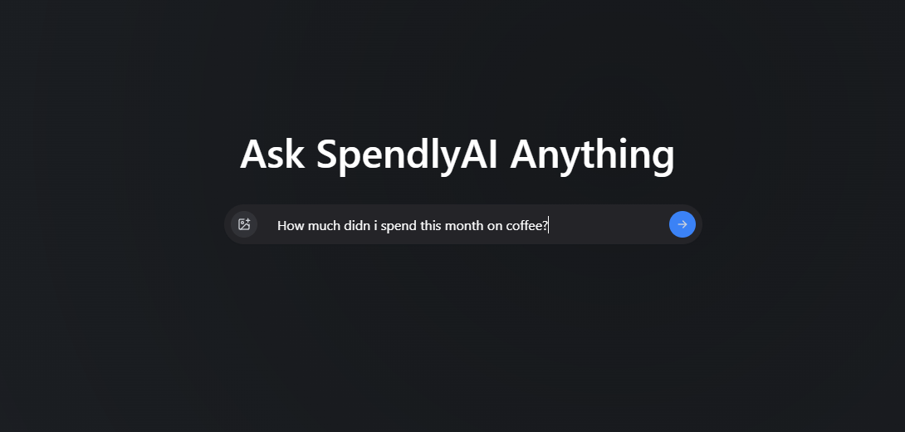

# Trace - Modern Receipt Management & Analysis Platform

A cutting-edge web application that leverages AI and OCR technology to revolutionize receipt management and expense analysis. Built with a modern tech stack and best practices in software architecture.



## 🚀 Key Technical Features

- **Modern Frontend Architecture**
  - Built with React + TypeScript + Vite for optimal performance
  - State management with TanStack Query
  - Elegant UI with Tailwind CSS, Radix UI, and Framer Motion animations
  - Real-time updates using WebSocket connections
  - Component-driven development

- **Powerful Backend Infrastructure**
  - FastAPI for high-performance async API endpoints
  - ChromaDB for vector storage and semantic search capabilities
  - LangChain for dynamic memory
  - MongoDB integration for data storage
  - OCR powered by DocTR (Document Text Recognition)

- **AI/ML Capabilities**
  - OpenAI integration for intelligent receipt analysis
  - Advanced OCR with DocTR for accurate text extraction
  - RAG (Retrieval Augmented Generation) for context-aware responses
  - Intelligent categorization and pattern recognition
  - Continuous learning from user interactions

- **Developer Experience**
  - Type-safe development with TypeScript
  - Modern build system with Vite
  - Query management with TanStack Query
  - Utility-first styling with Tailwind CSS
  - Comprehensive ESLint configuration

- **Docker Support**
  - Multi-stage builds for optimized container sizes
  - Persistent volumes for ML models and ChromaDB
  - Containerized development and production environments
  - Docker Compose for easy orchestration
  - Hot-reload support in development

## Architecture

The project follows a modern microservices architecture:

```
frontend/                 # React + TypeScript frontend
  ├── src/
  │   ├── api/           # API integration layer
  │   ├── components/    # Reusable UI components
  │   ├── pages/        # Page components
  │   └── lib/          # Utility functions
  
backend/                  # FastAPI + Python backend
  ├── app/
  │   ├── llm_service.py   # AI/ML processing
  │   ├── rag_service.py   # RAG implementation
  │   └── memory_service.py # Chat history management
```

## 🛠️ Tech Stack

### Frontend
- React
- TypeScript
- Vite
- TanStack Query
- Tailwind CSS
- Radix UI
- Framer Motion

### Backend
- FastAPI
- ChromaDB
- LangChain
- MongoDB
- DocTR
- OpenAI
- Python

### Infrastructure
- Docker
- Docker Compose
- Persistent Volumes
- Multi-stage Builds

## 🚀 Getting Started

### Local Development

1. Clone the repository:
   ```bash
   git clone https://github.com/createdbyadham/Trace.git
   cd Trace
   ```

2. Install frontend dependencies:
   ```bash
   cd frontend
   npm install
   ```

3. Install backend dependencies:
   ```bash
   cd backend
   pip install -r requirements.txt
   ```

4. Set up environment variables:
   ```bash
   # Create .env in project root
   OPENAI_API_KEY=your_key_here
   MONGODB_URI=your_mongodb_uri
   ```

5. Start the development servers:
   ```bash
   # Terminal 1 - Frontend
   cd frontend
   npm run dev

   # Terminal 2 - Backend
   cd backend
   python -m uvicorn main:app --reload
   ```

### Docker Deployment

1. Clone the repository:
   ```bash
   git clone https://github.com/createdbyadham/Trace.git
   cd Trace
   ```

2. Set up environment variables:
   ```bash
   # Create backend/.env file with required variables
   OPENAI_API_KEY=your_key_here
   MONGODB_URI=your_mongodb_uri
   ```

3. Build and start the containers:
   ```bash
   docker compose up --build
   ```

The application will be available at:
- Frontend: http://localhost:5173
- Backend API: http://localhost:8000

### Docker Volumes

The application uses two persistent volumes:
- `model-cache`: Stores downloaded ML models
- `chroma-data`: Stores ChromaDB vector database

These volumes persist data across container restarts and rebuilds.
